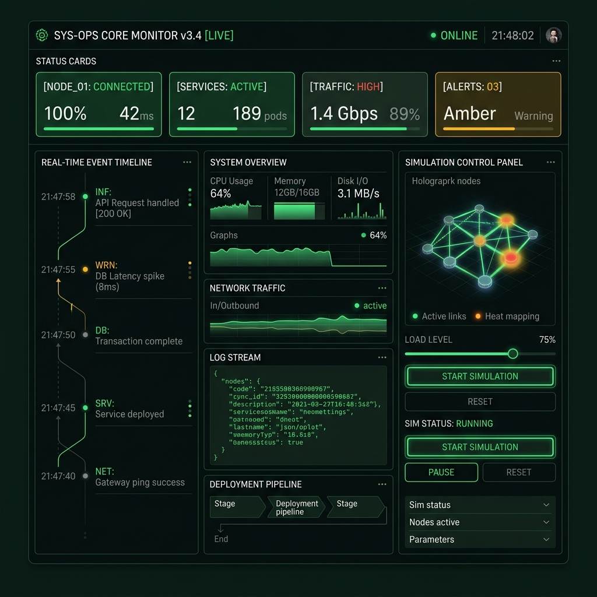
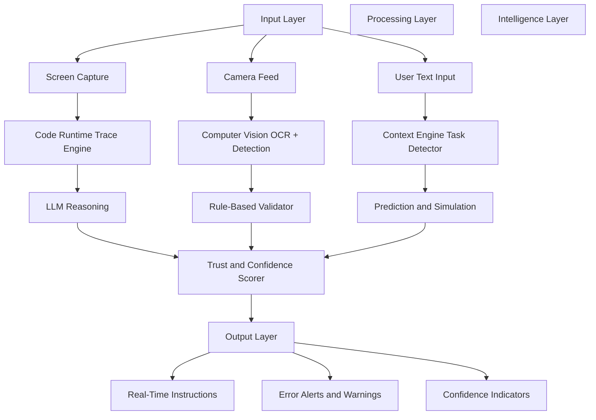
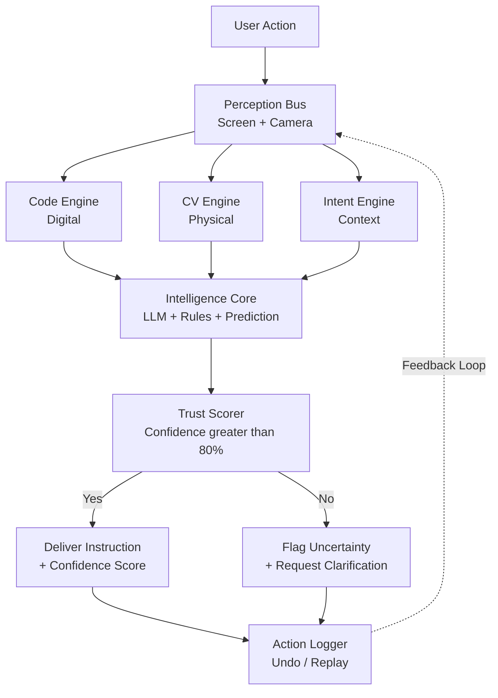
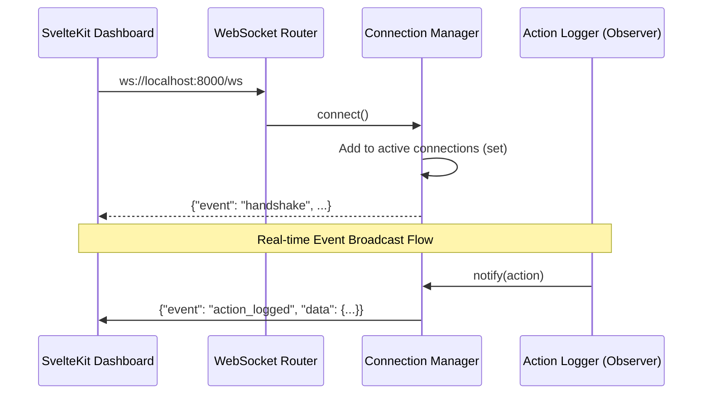
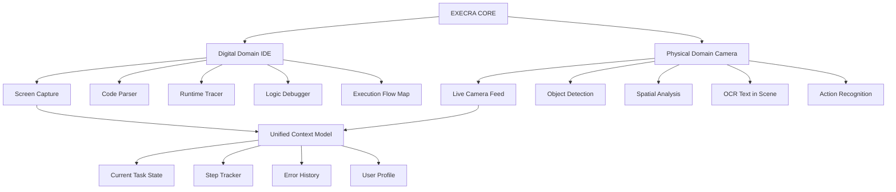
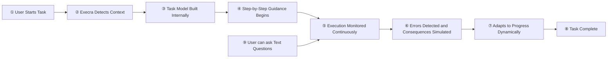
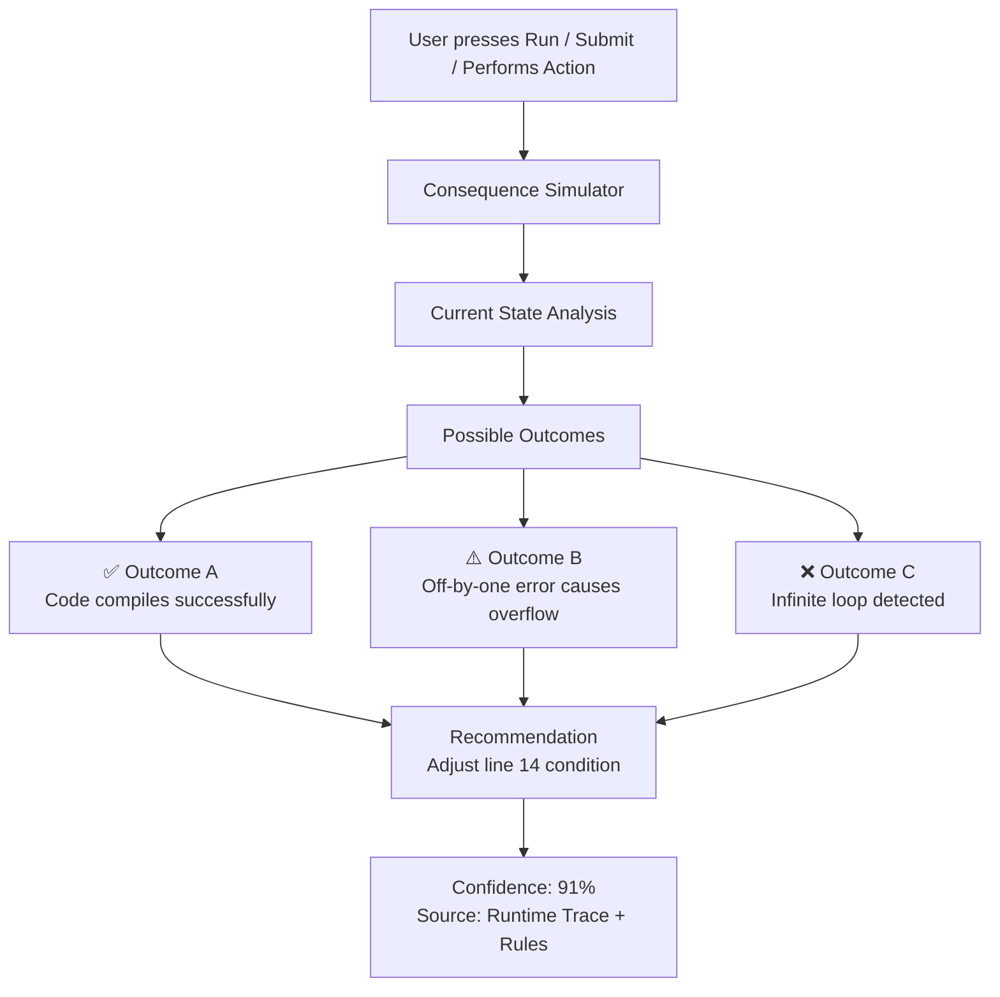
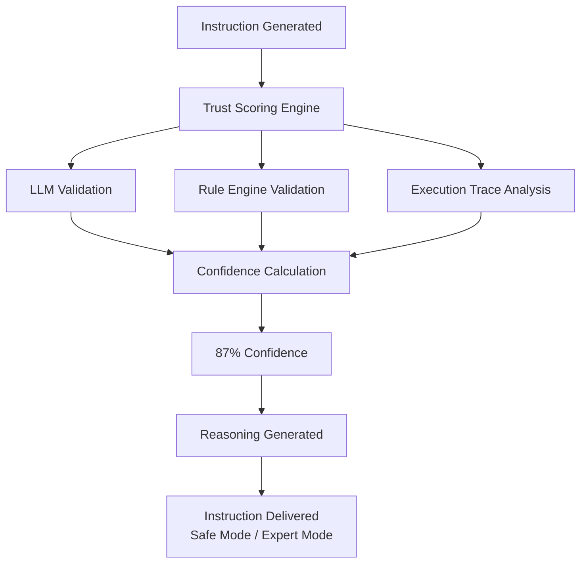
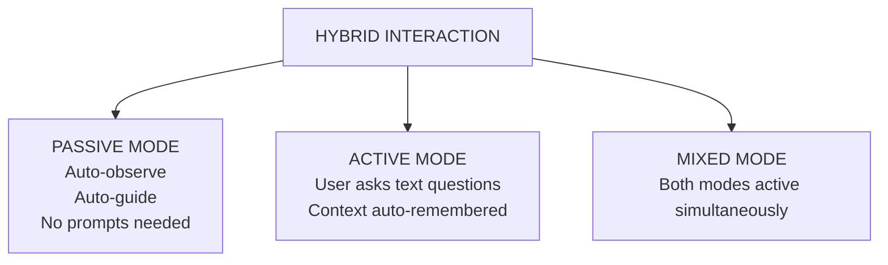
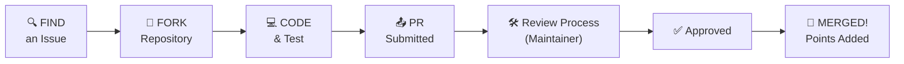

<div align="center">


<br/>

<!-- Badges -->
<a href="https://github.com/sahoo-tech/execra/stargazers"></a>
<a href="https://github.com/sahoo-tech/execra/network/members"></a>
<a href="https://github.com/sahoo-tech/execra/issues"></a>
<a href="https://github.com/sahoo-tech/execra/blob/main/LICENSE"></a>
<a href="https://github.com/sahoo-tech/execra/pulls"></a>


<br/><br/>

> **"Don't learn to do it — just do it correctly, right now."**
>
> *Execra is not a chatbot. Not a tutorial. Not a coding assistant. It is your real-time execution partner — observing, understanding, and guiding every action you take, before mistakes happen.*

<br/>

[](https://gssoc.girlscript.tech/)
&nbsp;
[](https://opensource.org/)
&nbsp;
[](https://github.com/sahoo-tech/execra/pulls)

</div>

---

## 📑 Table of Contents

<details open>
<summary><b>Click to expand / collapse</b></summary>

- [🌟 What is Execra?](#-what-is-execra)
- [🎯 Core Objective](#-core-objective)
- [🔥 The Problem We Solve](#-the-problem-we-solve)
- [✨ Core Capabilities](#-core-capabilities)
- [🏗️ System Architecture](#️-system-architecture)
- [🔄 User Workflow](#-user-workflow)
- [🧠 Intelligence Layers Explained](#-intelligence-layers-explained)
- [💻 Tech Stack](#-tech-stack)
- [🚀 Getting Started](#-getting-started)
- [📂 Project Structure](#-project-structure)
- [🤝 Contributing (GSSoC 2026)](#-contributing-gssoc-2026)
- [🏷️ Issue Labels & Points](#️-issue-labels--points)
- [📜 Code of Conduct](#-code-of-conduct)
- [📄 License](#-license)
- [🙌 Acknowledgements](#-acknowledgements)
- [📬 Contact](#-contact)

</details>

---

## 🌟 What is Execra?

**Execra** *(Execution + Era)* is a **multimodal AI-powered Universal Execution Intelligence Layer** — a continuously running background system that observes your actions in real time across both **digital environments** (coding, software) and **physical environments** (real-world tasks via camera), and actively guides you through correct execution **before mistakes happen**.

> Unlike a chatbot that answers only when asked, Execra **acts like an expert sitting beside you**, watching your every step and speaking up the moment it predicts an error, inefficiency, or risk.

```
Traditional Workflow:        Execra Workflow:
┌──────────────────┐         ┌─────────────────────────────────┐
│  Search → Learn  │         │  Start Task → Execra Guides You │
│  → Practice      │   VS    │  in Real-Time → Execute         │
│  → Fail → Retry  │         │  Correctly → Done               │
└──────────────────┘         └─────────────────────────────────┘
```

### Real-Time Monitoring Dashboard

The SvelteKit dashboard provides a futuristic UI showing real-time telemetry, live action logs, active WebSocket connection status, and guidance feedback:



---

## 🎯 Core Objective

```
╔══════════════════════════════════════════════════════════════════╗
║                                                                  ║
║   Build an AI that does NOT wait for prompts.                    ║
║                                                                  ║
║   It OBSERVES → UNDERSTANDS → GUIDES → CORRECTS                  ║
║   continuously, in real time, without user re-explanation.       ║
║                                                                  ║
╚══════════════════════════════════════════════════════════════════╝
```

---

## 🔥 The Problem We Solve

| Pain Point | Current Reality | Execra's Solution |
|---|---|---|
| 🔍 **Searching** | Stop work → Google → read docs | Guidance appears in-context, zero search |
| 📚 **Learning Curve** | Spend hours learning before doing | Do directly with guided steps |
| ❌ **Trial & Error** | Make mistakes, debug, retry | Errors predicted before they happen |
| 🤖 **Generic AI** | Copy-pasted answers without context | Understands exactly what *you* are doing |
| 📷 **Physical Tasks** | No AI help for real-world work | Camera-based real-world guidance |
| 🔁 **Re-explaining AI** | Repeat yourself each session | Remembers full context of current session |

---

## ✨ Core Capabilities

<table>
<tr>
<td width="50%" valign="top">

### 👁️ 1. Multimodal Perception
- 🖥️ Screen capture (code, software UI)
- 📷 Camera feed (real-world tasks)
- 🔤 OCR — text recognition
- 🧩 Object detection & UI understanding
- ⚡ Continuous action tracking
- 🛡️ **Privacy Masking Engine (Local Redaction)**

### 🧭 2. Context & Intent Understanding
- 📌 Auto-detect task type (no prompt needed)
- 🎯 Infer user goal from observation
- 📋 Track current step in workflow
- 🔄 Maintain dynamic session context model

### ⚙️ 3. Execution Intelligence
- 📊 Decompose tasks into ordered steps
- 🔴 Real-time error detection
- 📡 Adapt instructions to user progress
- 🔮 Predict consequences before action

</td>
<td width="50%" valign="top">

### 💻 4. Coding System (Digital)
- 🪲 Runtime execution tracing
- 🔍 Logical error identification
- 💡 Explain errors from actual behavior (not just static analysis)
- 🏗️ Convert high-level goals → structured dev steps

### 🏠 5. Offline System (Physical)
- 🔧 Detect objects & tools via camera
- 🍳 Guide cooking, repairs, form filling
- 🚨 Intervene before incorrect actions
- 📍 Recognize task type from visual input

### 🛡️ 6. Trust & Authenticity Layer
- 📊 Confidence score on every instruction
- 🔍 Reasoning & explanation per suggestion
- 🔁 Multi-source validation (rules + model + data)
- ⚠️ Uncertainty flagging
- 🐢 Safe Mode | ⚡ Expert Mode

</td>
</tr>
</table>

---


## 🏗️ System Architecture

### High-Level Architecture Diagram


### Subsystem Communication Flow



---

### Real-Time WebSocket & API Architecture

Execra implements a decoupled, event-driven observer pattern to broadcast action events to connected clients in real time. The sequence below describes the handshake and notification lifecycle.



#### WebSocket Event Schema

##### 1. Server Handshake Response
Sent immediately upon client connection:
```json
{
  "event": "handshake",
  "version": "1.0.0",
  "message": "Connected to ws://localhost:8000/ws"
}
```

##### 2. Action Logged Broadcast
Broadcasting payload to all active connections when a physical or digital action is recorded:
```json
{
  "event": "action_logged",
  "data": {
    "id": "act_1716200230",
    "session_id": "sess_9123",
    "timestamp": "2026-05-20T11:24:35.832Z",
    "type": "user_click",
    "description": "Clicked dashboard simulation button",
    "domain": "digital",
    "was_guided": true,
    "guidance_confidence": 0.95
  }
}
```

#### REST API Endpoints

| Method | Endpoint | Description | Payload Schema / Response |
|--------|----------|-------------|----------------------------|
| **GET** | `/api/v1/actions` | Retrieve recently recorded execution actions. | `{"actions": [...], "count": 2}` |
| **POST** | `/api/v1/actions` | Log a new action record and broadcast to WebSocket observers. | `ActionRecord` model |
| **POST** | `/api/v1/actions/undo` | Revert the last execution action from the log. | `{"message": "Action undone", "action_undone": {...}}` |

---

### Dual-Domain Architecture (Digital + Physical)



---

## 🔄 User Workflow



---

### Step-by-Step Execution Detail

| Step | What Happens | Who Acts |
|------|-------------|----------|
| **1. Start** | User begins any task (opens editor, starts camera, opens form) | User |
| **2. Detection** | Execra auto-detects: task type, domain (digital/physical), current state | Execra |
| **3. Modeling** | Internal task model built: steps, dependencies, expected sequence | Execra |
| **4. Guidance** | Step-by-step instructions displayed in an overlay/panel | Execra |
| **5. Monitoring** | Every action tracked against expected behavior in real time | Execra |
| **6. Error Detection** | Deviations flagged; consequences simulated before commitment | Execra |
| **7. Adaptation** | Instructions updated dynamically based on user progress | Execra |
| **8. Completion** | Task completed with minimal trial-and-error | Both |
| **9. Active Mode** | At any time, user can type a question — context auto-remembered | User + Execra |

---

## 🧠 Intelligence Layers Explained

### Layer 1 — Consequence Simulation Engine


### Layer 2 — Trust & Confidence Scoring



```text
Every instruction delivered by Execra includes:

┌──────────────────────────────────────────────────────┐
│  📋 INSTRUCTION: "Add null check before line 42"     │
│                                                      │
│  🔵 Confidence:  ████████░░  87%                     │
│  📚 Source:      LLM + Rule Engine + Execution Trace │
│  💬 Reasoning:   "Variable `config` returns None     │
│                   in 3 edge cases detected."         │
│  🔘 Mode:        [Safe Mode] / Expert Mode           │
└──────────────────────────────────────────────────────┘
```

---

### Layer 3 — Hybrid Interaction System



---
## 💻 Tech Stack

<table>
<thead>
<tr>
<th>Layer</th>
<th>Technology</th>
<th>Purpose</th>
</tr>
</thead>
<tbody>
<tr>
<td><b>👁️ Screen Capture</b></td>
<td>PyAutoGUI, mss, Pillow</td>
<td>Continuous screen recording & analysis</td>
</tr>
<tr>
<td><b>📷 Camera / CV</b></td>
<td>OpenCV, YOLOv8, Tesseract OCR</td>
<td>Real-world object detection & text reading</td>
</tr>
<tr>
<td><b>🧠 LLM Core</b></td>
<td>OpenAI GPT-4o / Gemini 1.5 Pro / Llama 3</td>
<td>Reasoning, explanation, task decomposition</td>
</tr>
<tr>
<td><b>⚙️ Code Engine</b></td>
<td>Python AST, sys.settrace, PyDebug</td>
<td>Runtime tracing & execution flow analysis</td>
</tr>
<tr>
<td><b>🗂️ Context Engine</b></td>
<td>LangChain, custom session manager</td>
<td>Maintaining dynamic session context model</td>
</tr>
<tr>
<td><b>🔁 Rule Validator</b></td>
<td>Drools / Python rule engine</td>
<td>Deterministic validation alongside LLM</td>
</tr>
<tr>
<td><b>📊 Trust Scorer</b></td>
<td>Custom scoring pipeline</td>
<td>Confidence scoring per instruction</td>
</tr>
<tr>
<td><b>🖥️ Frontend / Overlay</b></td>
<td>Electron.js / Tauri / Web Overlay</td>
<td>Real-time guidance UI overlaid on screen</td>
</tr>
<tr>
<td><b>🔔 Notification</b></td>
<td>Plyer / OS Notification APIs</td>
<td>Proactive alerts & guidance delivery</td>
</tr>
<tr>
<td><b>💾 Storage</b></td>
<td>SQLite / Redis (hot) + S3 (cold)</td>
<td>Action history, undo stack, session logs</td>
</tr>
<tr>
<td><b>🛡️ Privacy Engine</b></td>
<td>OpenCV, Regex (PII Patterns)</td>
<td>Local data sanitization & masking</td>
</tr>
<tr>
<td><b>🐳 Deployment</b></td>
<td>Docker, Kubernetes</td>
<td>Scalable microservice deployment</td>
</tr>
<tr>
<td><b>🔗 API Layer</b></td>
<td>FastAPI</td>
<td>REST + WebSocket endpoints for real-time I/O</td>
</tr>
</tbody>
</table>

---

## 🚀 Getting Started

### Prerequisites

```bash
# Python 3.10+
python --version

# Node.js 18+ (for overlay frontend)
node --version

# FFmpeg (for camera stream processing)
ffmpeg -version
```

### Installation

```bash
# 1. Clone the repository
git clone https://github.com/sahoo-tech/execra.git
cd execra/Execra

# 2. Create virtual environment
python -m venv venv
source venv/bin/activate         # Linux/Mac
venv\Scripts\activate            # Windows

# 3. Install Python dependencies
pip install -r requirements.txt

# 4. Install SvelteKit Dashboard dependencies
cd dashboard
npm install
cd ..
```

### Running the Services Locally

#### 1. Start the FastAPI Backend
From the `Execra` root directory:
```bash
# Windows
venv\Scripts\python.exe main.py

# Linux/Mac
./venv/bin/python main.py
```
The API server will run at `http://localhost:8000`. Swagger documentation is available at `http://localhost:8000/docs`.

#### 2. Start the SvelteKit Dashboard
From the `Execra/dashboard` directory:
```bash
npm run dev
```
The dashboard interface will run at `http://localhost:5173`.

### Quick Start (Docker)

```bash
# Build and run both backend and frontend with Docker Compose
docker-compose up --build

# Services will be running at:
# API Backend:      http://localhost:8000
# Svelte Dashboard: http://localhost:5173
```


---

## 📂 Project Structure

```text
execra/
│
├── core/
│   │
│   ├── perception/
│   │   ├── screen_capture.py        # Screen capture engine
│   │   ├── camera_feed.py           # Camera input handler
│   │   ├── ocr_engine.py            # Text recognition (Tesseract)
│   │   └── privacy_masker.py        # PII & geometric redaction
│   │
│   ├── intelligence/
│   │   ├── llm_client.py            # LLM abstraction layer
│   │   ├── context_engine.py        # Session/context manager
│   │   ├── consequence_sim.py       # Outcome prediction engine
│   │   └── trust_scorer.py          # Confidence scoring pipeline
│   │
│   ├── digital/
│   │   ├── code_tracer.py           # Runtime execution tracer
│   │   ├── error_detector.py        # Logical/runtime issue detector
│   │   └── task_decomposer.py       # Goal → execution steps
│   │
│   ├── physical/
│   │   ├── object_detector.py       # YOLO-based detection
│   │   ├── task_recognizer.py       # Physical task classification
│   │   └── action_validator.py      # Real-world action validator
│   │
│   └── hybrid/
│       ├── mode_manager.py          # Passive/Active mode manager
│       ├── action_logger.py         # Undo/replay tracking
│       └── guidance_dispatcher.py   # Instruction delivery system
│
├── api/
│   │
│   ├── main.py                      # FastAPI application entry
│   │
│   ├── routes/
│   │   ├── health.py                # Health check endpoints
│   │   ├── execution.py             # Execution guidance APIs
│   │   └── context.py               # Session/context APIs
│   │
│   └── websockets/
│       └── realtime.py              # Real-time communication layer
│
├── models/
│   │
│   ├── yolo/                        # YOLO model weights
│   └── custom/                      # Custom-trained classifiers
│
├── tests/
│   │
│   ├── unit/                        # Unit tests
│   ├── integration/                 # Integration tests
│   └── e2e/                         # End-to-end tests
│
├── docs/
│   ├── architecture.md              # System architecture docs
│   ├── api_reference.md             # API documentation
│   └── contributing_guide.md        # Contributor onboarding guide
│
├── scripts/
│   ├── download_models.py           # Download AI model weights
│   └── setup_environment.py         # Local environment setup
│
├── .github/
│   ├── ISSUE_TEMPLATE/              # GitHub issue templates
│   ├── workflows/                   # GitHub Actions workflows
│   └── pull_request_template.md     # PR template
│
├── configs/
│   ├── development.yaml             # Development configuration
│   ├── production.yaml              # Production configuration
│   └── logging.yaml                 # Logging configuration
│
├── assets/
│   ├── logo/                        # Branding assets
│   ├── screenshots/                 # README screenshots
│   └── diagrams/                    # Architecture diagrams
│
├── docker-compose.yml               # Multi-container orchestration
├── Dockerfile                       # Docker image definition
├── requirements.txt                 # Python dependencies
├── pyproject.toml                   # Project metadata/config
├── pytest.ini                       # Pytest configuration
├── .env.example                     # Environment variables template
├── .gitignore                       # Ignored files
├── LICENSE                          # MIT license
├── README.md                        # Project documentation
└── main.py                          # Main application entry point
```

---

## 🤝 Contributing (GSSoC 2026)

<div align="center">

### 🎉 Welcome, GirlScript Summer of Code 2026 Contributors! 🎉


</div>

We're thrilled to have you here! Execra is an **open project** built for and by the community. Whether you're a beginner or an expert, there's a place for you.

---

### 🛣️ Contribution Roadmap



---

### 📝 Step-by-Step Contribution Guide

```bash
# Step 1: Fork this repository on GitHub

# Step 2: Clone your fork
git clone https://github.com/YOUR_USERNAME/execra.git
cd execra

# Step 3: Create a new branch (NEVER work on main directly)
git checkout -b feature/your-feature-name
# OR for bug fixes:
git checkout -b fix/issue-number-short-description

# Step 4: Make your changes and test them
python -m pytest tests/

# Step 5: Commit with a clear message
git add .
git commit -m "feat: add OCR support for multi-language text detection (#42)"

# Step 6: Push to your fork
git push origin feature/your-feature-name

# Step 7: Open a Pull Request on GitHub
# Use the PR template provided in the repository
```

---

### ✅ Commit Message Convention

We follow [Conventional Commits](https://www.conventionalcommits.org/):

| Prefix | Use When |
|--------|----------|
| `feat:` | Adding a new feature |
| `fix:` | Fixing a bug |
| `docs:` | Documentation only changes |
| `style:` | Code formatting (no logic change) |
| `refactor:` | Code restructuring (no feature/bug) |
| `test:` | Adding or updating tests |
| `chore:` | Build process, tooling changes |

**Examples:**
```
feat: implement real-time screen delta detection
fix: resolve memory leak in camera feed handler (#88)
docs: add API reference for context engine
test: add unit tests for trust scorer module
```

---

### 🔍 Finding Good First Issues

Look for these labels on the [Issues page](https://github.com/sahoo-tech/execra/issues):

| Label | Difficulty | Good For |
|-------|-----------|----------|
| `good first issue` | ⭐ Beginner | First-time contributors |
| `easy` | ⭐⭐ Easy | Those with some experience |
| `medium` | ⭐⭐⭐ Medium | Intermediate contributors |
| `hard` | ⭐⭐⭐⭐ Hard | Advanced contributors |
| `documentation` | Any | Writers, tech writers |
| `help wanted` | Varies | Any contributor |

---

## 🏷️ Issue Labels & Points

> Points are awarded by GSSoC 2026 based on issue difficulty and contribution quality.

<table>
<thead>
<tr>
<th>Label</th>
<th>Points</th>
<th>Typical Tasks</th>
</tr>
</thead>
<tbody>
<tr>
<td> <code>good first issue</code></td>
<td><b>10 pts</b></td>
<td>Fixing typos, adding docstrings, small UI tweaks, writing examples</td>
</tr>
<tr>
<td> <code>easy</code></td>
<td><b>25 pts</b></td>
<td>Adding unit tests, small bug fixes, minor feature additions</td>
</tr>
<tr>
<td> <code>medium</code></td>
<td><b>45 pts</b></td>
<td>Feature modules, integration tasks, significant bug fixes</td>
</tr>
<tr>
<td> <code>hard</code></td>
<td><b>60 pts</b></td>
<td>Core architecture, new domain engines, performance optimization</td>
</tr>
</tbody>
</table>

---

### 🚫 What NOT to Do

```
❌  Do NOT submit empty or low-quality PRs just to collect points
❌  Do NOT spam issues asking to be assigned without reviewing
❌  Do NOT copy code from others without attribution
❌  Do NOT make changes outside the scope of the assigned issue
❌  Do NOT force-push to main or shared branches
✅  DO read the full issue before asking questions
✅  DO test your changes before submitting
✅  DO follow the code style guide (see CONTRIBUTING.md)
✅  DO be respectful and patient with maintainers
```

---

### 💬 Community & Support

| Channel | Link |
|---------|------|
| 💬 Discussion | [GitHub Discussions](https://github.com/sahoo-tech/execra/discussions) |
| 🐛 Bug Reports | [Open an Issue](https://github.com/sahoo-tech/execra/issues/new?template=bug_report.md) |
| 💡 Feature Requests | [Request Feature](https://github.com/sahoo-tech/execra/issues/new?template=feature_request.md) |
| 📧 Maintainer | ss9830872697@gmail.com |

---

## 📜 Code of Conduct

This project follows the [Contributor Covenant Code of Conduct v2.1](CODE_OF_CONDUCT.md).

**In summary:**
- 🤝 Be welcoming and inclusive
- 🗣️ Be respectful in all communications
- 🚫 No harassment, discrimination, or harmful behavior
- 🌱 Help beginners; everyone starts somewhere

Violations can be reported to **ss9830872697@gmail.com**.

---

## 📄 License

```
MIT License

Copyright (c) 2026 Execra Contributors

Permission is hereby granted, free of charge, to any person obtaining a copy
of this software and associated documentation files (the "Software"), to deal
in the Software without restriction, including without limitation the rights
to use, copy, modify, merge, publish, distribute, sublicense, and/or sell
copies of the Software, subject to the following conditions:

The above copyright notice and this permission notice shall be included in all
copies or substantial portions of the Software.
```

See [LICENSE](LICENSE) for the full text.

---

## 🙌 Acknowledgements

<div align="center">

**Powered By**

[](https://gssoc.girlscript.tech/)
&nbsp;
[](https://openai.com)
&nbsp;
[](https://gemini.google.com)
&nbsp;
[](https://ultralytics.com)

</div>

Special thanks to:
- 🌸 **GirlScript Foundation** — for organizing GSSoC and empowering open source contributors worldwide
- All first-time contributors who made this project possible
- The open source community for the foundational tools this project builds upon

---

## 📬 Contact

<div align="center">

| Maintainer | GitHub | Email |
|-----------|--------|-------|
| Sayantan Sahoo | [@sahoo-tech](https://github.com/sahoo-tech) | ss9830872697@gmail.com |

<br/>

**Found this project interesting? Give it a ⭐ — it helps us grow!**

<br/>


</div>

---

<div align="center">

*Built with ❤️ for GirlScript Summer of Code 2026*

*Execra — Execute without boundaries.*

</div>
